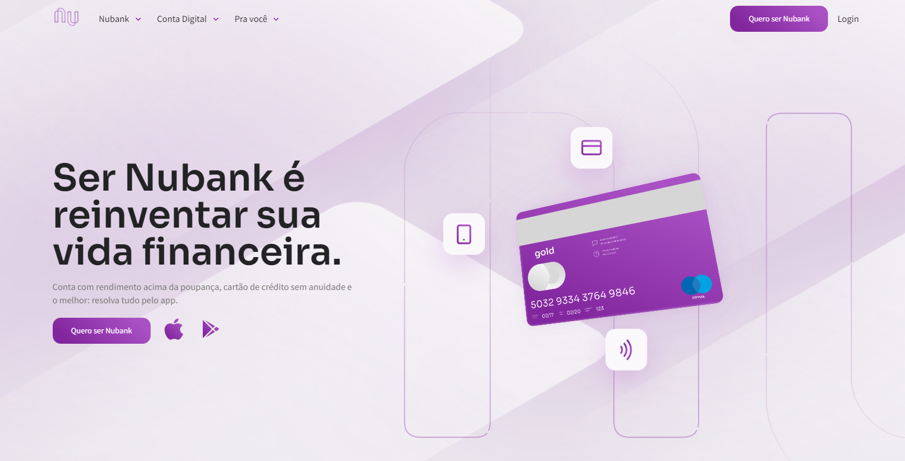

# Nubank - UI DESIGN, FRONT & MOTION.

  

# 🎇 Tecnologias

Esse projeto foi desenvolvido com as seguintes tecnologias:

- HTML 5
- CSS 3
- JavaScript
- SASS
- AOS

# 🎆 Sites utilizado para o desenvolvimento

- [MDN - CSS](https://developer.mozilla.org/pt-BR/docs/Web/CSS) - O MDN Web Docs é o website oficial de Mozilla para desenvolvimento de padrões web.
- [AOS - JavaScript](https://michalsnik.github.io/aos/) - Animate On Scroll Library

# 🎯 Acesse ao projeto

Você pode acessar o site pelo link abaixo:

- [Nubank](https://nubank-lucas.netlify.app/) - O site está hospedado gratuitamente na Netlify

# 💼 Direitos

- Todos os direitos reservados por Násser Yousef Ali - [FrontPUSH](https://www.frontpush.com.br/)  
- Feito por Lucas Cano.
